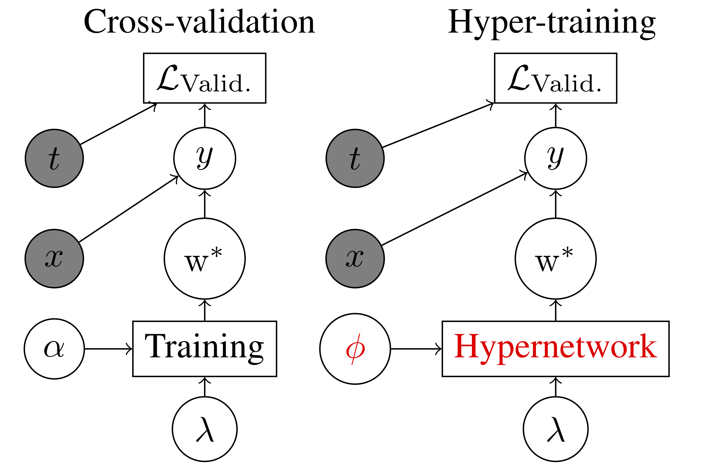
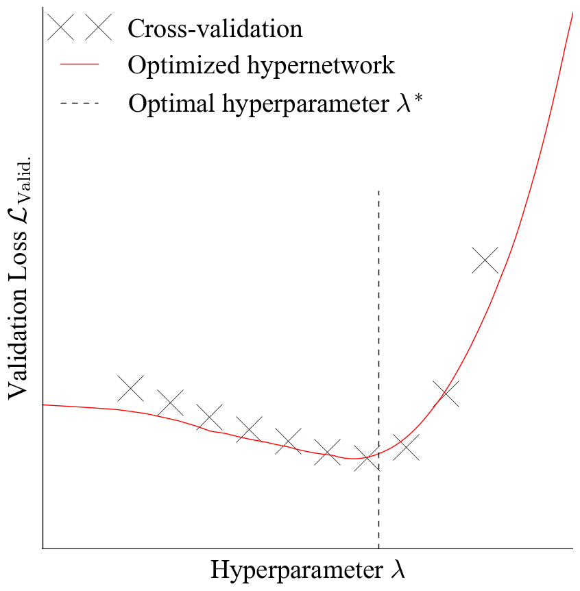
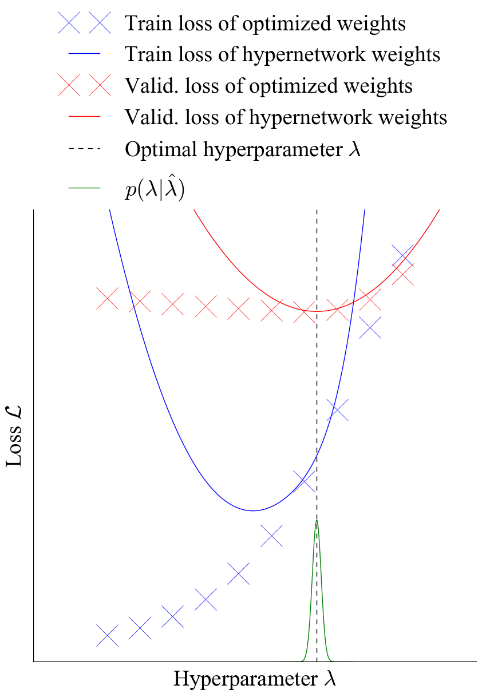
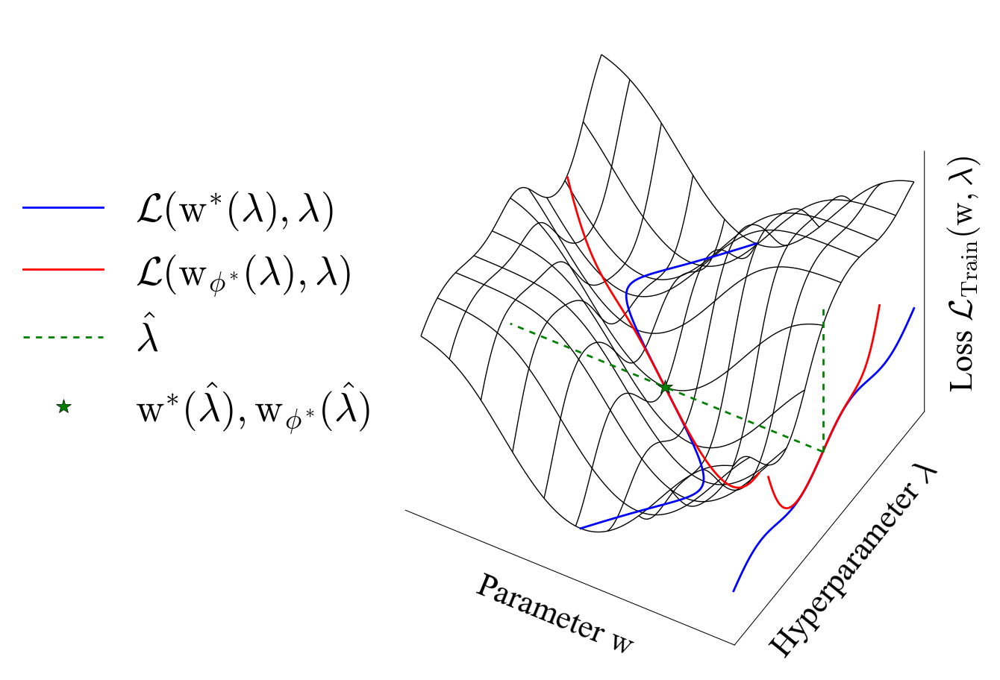
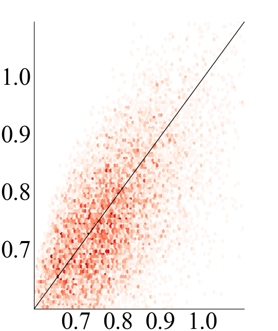
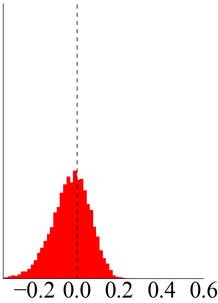
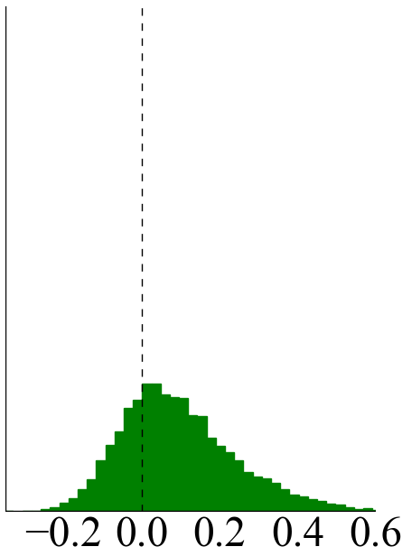
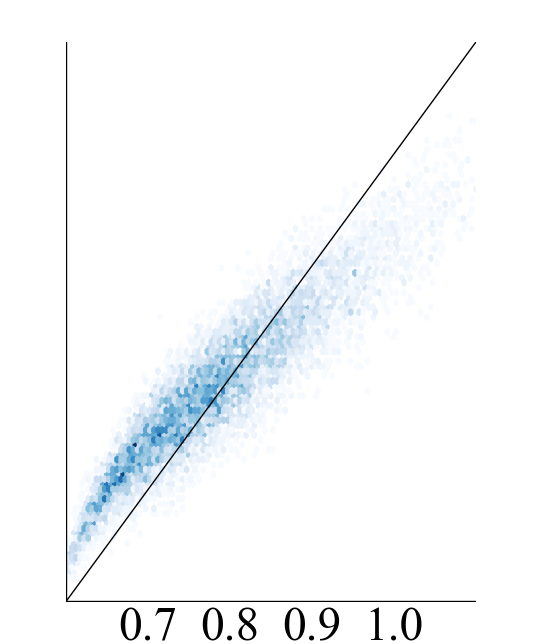
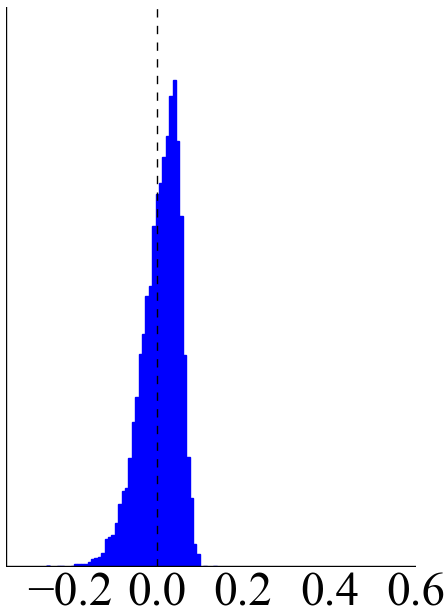

# Stochastic Hyperparameter Optimization through Hypernetworks



This repository contains code for running the experiments of and generating the paper in Stochastic Hyperparameter Optimization through Hypernetworks.
The paper is also located on [arXiv](https://arxiv.org/abs/1802.09419).

### Getting Started

The repository can be copied to your local machine with:

```
git clone https://github.com/lorraine2/hypernet-hypertraining.git
```


### Prerequisites and Installation

In order to run the experiments you must download the following dependencies (which are included with requirements.txt):

```
Autograd - pip install autograd

Matplotlib - pip install matplotlib

Scikit Learn - pip install scikit-learn
```

Or to use requirements.txt from inside of the main directory:

```
pip install -r requirements.txt
```

## Running the Experiments

The `code/` directory contains code for experiments.
Attempt to execute the following commands starting from the `code/` directory to generate the subsequent images.

For the global response approximation (with a low dimensional hyperparameter and high capacity hypernetwork) run:

```
python hypernets_global_small.py
```


For the local response approximation and hyperparameter optimization (with a low dimensional hyperparameter and low 
capacity hypernetwork) run:

```
python hypernets_local_small.py
```


For the training and validation loss manifolds run:

```
python loss_manifold.py
```



For the comparison of learning weights versus learning the loss run:

```
python learn_vs_true_loss_scatter.py
```







## Generating the Paper

The `paper/` directory contains all files for generating the arXiv paper.
Compiling the `main.tex` file will generate a `main.pdf` file which contains the paper.
The file `main_bib.bib` contains all bibliographic references.


## File Structure

```
.
├── LICENSE.md
├── README.md
├── code
│   ├── __init__.py
│   ├── __init__.pyc
│   ├── __pycache__
│   │   ├── __init__.cpython-35.pyc
│   │   ├── data_loader.cpython-35.pyc
│   │   ├── neural_network.cpython-35.pyc
│   │   ├── optimizers.cpython-35.pyc
│   │   └── plotting.cpython-35.pyc
│   ├── data
│   │   ├── t10k-images-idx3-ubyte.gz
│   │   ├── t10k-labels-idx1-ubyte.gz
│   │   ├── train-images-idx3-ubyte.gz
│   │   └── train-labels-idx1-ubyte.gz
│   ├── data_loader.py
│   ├── data_loader.pyc
│   ├── figures
│   │   ├── ax0_hist.pdf
│   │   ├── ax0_hist.png
│   │   ├── ax0_scatter.pdf
│   │   ├── ax0_scatter.png
│   │   ├── ax1_hist.pdf
│   │   ├── ax1_hist.png
│   │   ├── ax1_scatter.pdf
│   │   ├── ax1_scatter.png
│   │   ├── ax2_hist.pdf
│   │   ├── ax2_hist.png
│   │   ├── ax2_scatter.pdf
│   │   ├── ax2_scatter.png
│   │   ├── hypernets_global_small.pdf
│   │   ├── hypernets_local_small.pdf
│   │   ├── learn_vs_true_loss_hist.pdf
│   │   ├── learn_vs_true_loss_hist.png
│   │   ├── learn_vs_true_loss_scatter.pdf
│   │   ├── learn_vs_true_loss_scatter.png
│   │   ├── train_loss_manifold.pdf
│   │   ├── train_loss_manifold.png
│   │   ├── valid_loss_manifold.pdf
│   │   └── valid_loss_manifold.png
│   ├── hypernets_global_small.py
│   ├── hypernets_local_small.py
│   ├── learn_vs_true_loss_scatter.pickle
│   ├── learn_vs_true_loss_scatter.py
│   ├── loss_manifold.py
│   ├── neural_network.py
│   ├── neural_network.pyc
│   ├── optimizers.py
│   ├── optimizers.pyc
│   ├── plotting.py
│   └── plotting.pyc
├── hypernet-hypertraining.png
├── paper
│   ├── algorithm.sty
│   ├── algorithmic.sty
│   ├── ax0_hist.pdf
│   ├── ax0_hist.png
│   ├── ax0_scatter.pdf
│   ├── ax0_scatter.png
│   ├── ax1_hist.pdf
│   ├── ax1_hist.png
│   ├── ax1_scatter.pdf
│   ├── ax1_scatter.png
│   ├── ax2_hist.pdf
│   ├── ax2_hist.png
│   ├── ax2_scatter.pdf
│   ├── ax2_scatter.png
│   ├── compare_number_layers.png
│   ├── defs.tex
│   ├── fancyhdr.sty
│   ├── hypernets_global_small.pdf
│   ├── hypernets_global_small.png
│   ├── hypernets_local_large.pdf
│   ├── hypernets_local_small.pdf
│   ├── hypernets_local_small.png
│   ├── icml2018.bst
│   ├── icml2018.log
│   ├── icml2018.sty
│   ├── main.aux
│   ├── main.bbl
│   ├── main.blg
│   ├── main.log
│   ├── main.out
│   ├── main.pdf
│   ├── main.synctex.gz
│   ├── main.tex
│   ├── main_bib.bib
│   ├── main_bib.log
│   ├── natbib.sty
│   ├── train_loss_manifold.pdf
│   ├── train_loss_manifold.png
│   ├── valid_loss_manifold.pdf
│   └── valid_loss_manifold.png
└── requirements.txt

5 directories, 90 files
```

## Authors

* **Jonathan Lorraine** - [GitHub](https://github.com/lorraine2), [Home](https://www.cs.toronto.edu/~lorraine/)

* **Professor David Duvenaud** - [GitHub](https://github.com/duvenaud), [Home](https://www.cs.toronto.edu/~lorraine/)
